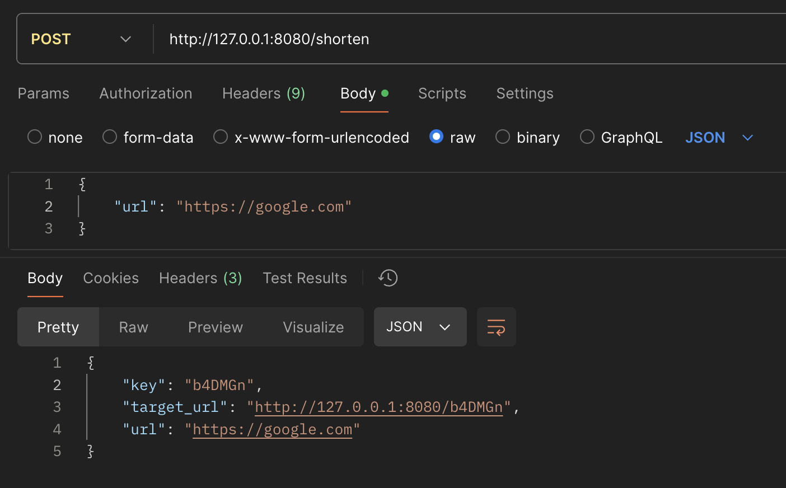
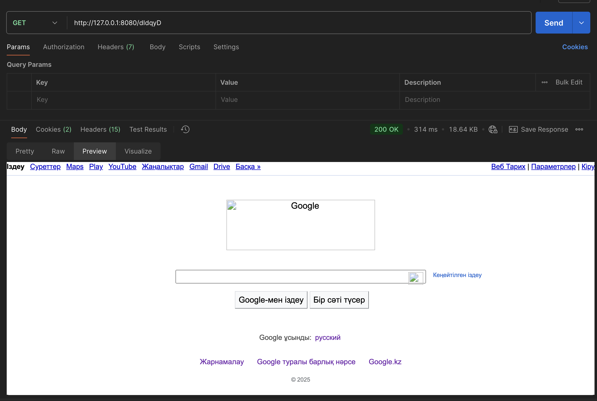

# INF-368 CT-2 Project (URL Shortener)
### Information
Name Surname: `Adilzhan Slyamgazy` <br>
Student ID: `220103151` <br>
Email: `220103151@stu.sdu.edu.kz` <br>
Telegram: `@herztard`

---
A simple in-memory URL shortener service written in Go.  
It provides:

- **POST** `/shorten` — accept a long URL, validate it, generate a unique 6-character key, and return JSON with the key and original URL.
- **GET** `/{short_key}` — look up the original URL by key and redirect (HTTP 302).

---

## Instructions

1. Clone repository
   ```bash
   git clone https://github.com/herztard/url_shortener_inf368.git
   cd url_shortener_inf368
   ```

2. Run project
   ```bash
   go run main.go
   ```

3. Endpoints

<details>
 <summary><code>POST</code> <code><b>/shorten</b></code> <code>(accept a long URL, validate it, generate a unique 6-character)</code></summary>

##### Parameters

> | name |  type     | data type | description |
> |------|-----------|-----------|-------------|
> | url  |  required | string    | full link to the website that needs to be shortened         |


##### Responses

> | http code | response                                                                                    |
> |-----------|---------------------------------------------------------------------------------------------|
> | `201`     | `{"key": "Abc123", "target_url": "http://localhost:8080/Abc123", "url":"https://google.com"}` |
> | `400`     | `Bad Request`                                                      |
> | `405`     | `Method Not Allowed`                                                                        |
> | `500`     | `Internal Serser Error`                                                                     |

##### Example cURL

> ```curl
> curl -L 'http://127.0.0.1:8080/shorten' \
> -H 'Content-Type: application/json' \
> -d '{
> "url": "https://google.com"
> }'
> ```



</details>

---

<details>
 <summary><code>GET</code> <code><b>/{short_key}</b></code> <code>look up the original URL by key and redirect (HTTP 302).</code></summary>

##### Responses

> | http code | response                             |
> |-----------|--------------------------------------|
> | `302`     | `Found Location: https://google.com` |
> | `400`     | `Bad Request`                        |
> | `405`     | `Method Not Allowed`                 |
> | `500`     | `Internal Serser Error`              |

##### Example cURL

> ```curl
> curl -L 'http://127.0.0.1:8080/dIdqyD'
> ```


</details>